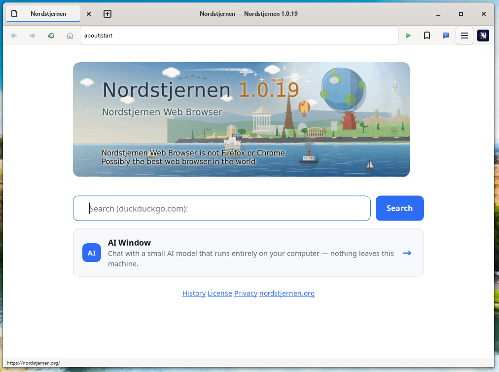
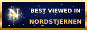

Nordstjernen web browser
========================

Nordstjernen is a web browser, written from scratch in C.
Focused on supporting the HTML and CSS standards.  
Nordstjernen is built in Norway. 

Runs on the platforms [Windows](https://apps.microsoft.com/detail/9nw8t7w5z4pl)  , MacOS, Linux, [Android](https://play.google.com/store/apps/details?id=org.nordstjernen.WebBrowser), Java, iOS. FreeBSD and NetBSD.  

**HTML Standards:** Behaviour is measured against the spec text, section by section, not against another browser — 140 spec rows fully implemented, 31 partial, and 0 absent across §1–§16 (July 2026), aside from a few features that are non-goals by design. 

**Security:** each tab's engine runs in its own sandboxed process (seccomp + Landlock on Linux) behind an IPC + shared-memory-framebuffer boundary · no JIT.

**Minimalism:** The whole engine is about 145,000 lines of C — small enough for one person to read and audit end-to-end. Audio and video add only small single-file decoders (pl_mpeg, minimp3) and SDL2 for audio output, not a media stack; WebM (VP9/VP8 + Opus/Vorbis) is an optional extra over FFmpeg's libav — the system copy on Linux, a minimal LGPL build bundled on macOS/Windows.

Nordstjernen has no JIT so it is much more secure, and can still be fast enough. It ships no telemetry of any kind.

   


## Standards compliance  

Nordstjernen is measured against the **spec text**, section by section,
not against any other browser. The section-by-section walk-through of
the in-scope WHATWG HTML standard (§1–§16) in
[docs/HTML-compatibility.md](docs/HTML-compatibility.md) currently
records **140 spec rows fully implemented, 31 partial, and 0 absent**
(July 2026), besides a handful that are non-goals by design, such as
in-process media codecs. Highlights:

| Spec area | Status |
|-----------|:------:|
| §2 Common infrastructure — WHATWG URL, IDN, origins, encodings | ✅ |
| §3–§4 Semantics, document structure & tabular content | ✅ |
| §4.8 Embedded content — images, SVG, `iframe`, minimalist MathML presentation layout; `<video>` decodes and plays inline (MPEG-1 always; VP9/VP8 WebM and MSE/`blob:` streams when FFmpeg libav is present) with WebVTT `<track>` captions rendered over the video; other codecs and `<audio>` render a poster and play overlay | 🟡 |
| §4.10 Forms — controls, validation, `valueAs*` | ✅ |
| §4.12–§4.13 Scripting, custom elements — autonomous **and customized built-in** elements (`is=` / `{extends}`) | ✅ |
| §6 User interaction — focus, `inert`, `contenteditable`, `hidden`/`content-visibility`, drag-and-drop incl. native file drops | ✅ |
| §7–§8 Loading pages, web application APIs — `fetch`, `XHR`, timers, observers, `history`, and the `Navigation` API (`navigation.navigate` with `intercept()`) | ✅ |
| §9 Communication — `WebSocket`, `EventSource`, `postMessage` | ✅ |
| §10 Web workers — dedicated workers (`fetch`, `crypto.subtle`, transferable `ArrayBuffer`s), Service Workers with `FetchEvent` interception, Cache API (Shared/module workers & worklets aside) | ✅ |
| §12 Web storage — `localStorage` / `sessionStorage` | ✅ |
| §13 HTML syntax (lexbor parser); §14 XML partial | ✅ |
| §15 Rendering — CSS cascade, flex, grid, transforms | ✅ |

The full section-by-section walk-through lives in
[docs/HTML-compatibility.md](docs/HTML-compatibility.md).

**What's absent.** No element or API row in §1–§16 is fully absent any
more — every one is implemented, partial, or a deliberate non-goal. The only
features that never will be added are **by-design non-goals**, absent on
purpose: `embed` / `object` plugins (no NPAPI/PPAPI), `frame` / `frameset`,
and the obsolete `applet` / `marquee` elements. Nordstjernen also deliberately
ships no telemetry and no AI-style web APIs.

Everything else that is not yet complete is tracked as **partial** (🟡) in
[docs/HTML-compatibility.md](docs/HTML-compatibility.md) rather than absent —
for example vertical `writing-mode` (single-column vertical text works;
multi-column wrapping and upright CJK do not), `iframe` `srcdoc` rendering,
quirks-mode layout deltas, and native date/time pickers.

## Browser features

- **HTML/CSS** via the lexbor parser — modern cascade, flex, grid,
  transforms, gradients, `@keyframes`.
- **JavaScript** on the QuickJS interpreter — DOM, Shadow DOM, observer
  APIs, Canvas 2D (`Path2D`, `ImageBitmap`, `DOMMatrix`), WebCrypto
  (`crypto.subtle` over OpenSSL).
- **Custom elements** — autonomous elements and **customized built-in
  elements**: `customElements.define(name, ctor, {extends})` plus
  `<button is="…">` upgrade the built-in through the full reaction
  lifecycle (`connectedCallback`, `attributeChangedCallback`,
  `observedAttributes`), keeping the built-in's own behaviour and members.
- **Navigation API** — `window.navigation` for single-page routing: a
  cancelable `navigate` event with `intercept({handler})`, a
  `NavigationHistoryEntry` model (`currentEntry`, `entries()`,
  `canGoBack`/`canGoForward`, `getState()`), `navigate`/`reload`/`back`/
  `forward`/`traverseTo`/`updateCurrentEntry`, and the
  `currententrychange`/`navigatesuccess`/`navigateerror` events.
- **Networking** over HTTP/2 with libcurl — HTTP/3 when the linked
  libcurl provides it — HSTS, CSP, subresource-integrity (SRI) checks,
  partitioned cookies.
- **Safe browsing** — before a top-level navigation is fetched, its host
  is checked against a local SHA-256 blocklist (`src/safebrowsing.c`,
  `data/safebrowsing.list`); a match shows a full-page warning with the
  choice to go back or continue. The check runs entirely on-device —
  nothing about your browsing leaves the machine — and the list is
  overridable via `~/.config/nordstjernen/safebrowsing.list` or
  `$NS_SAFEBROWSING_LIST`.
- **Media** — images, optional inline PDF; `<video>` plays **inline** for
  MPEG-1 (decoded in-tree by [pl_mpeg](https://github.com/phoboslab/pl_mpeg),
  MIT) and, when FFmpeg's libav is present at build time, **WebM** (VP9/VP8 +
  Opus/Vorbis), with `autoplay`/`loop`/click-to-play; MSE/`blob:` streaming
  plays inline through the `nordstjernen-video` helper. A `<track default>`
  WebVTT subtitle/caption file is parsed into timed cues and drawn over the
  video. Other codecs render a poster and play overlay. See
  [docs/media.md](docs/media.md).
- **MathML** — a minimalist presentation-MathML renderer (`src/mathml.c`)
  covering `mrow`, `mi`/`mn`/`mo`/`mtext`, `msup`/`msub`/`msubsup`,
  `mfrac`, `msqrt`/`mroot`, `munder`/`mover`/`munderover`, `mtable`,
  `mfenced`, and `mphantom`, laid out over Pango/Cairo and embedded
  inline on the text baseline.
- **Spell checking** — optional, via the Enchant library (`src/spellcheck.c`):
  misspelled words in editable text (text inputs, `textarea`,
  `contenteditable`) get a red wavy underline, honouring the `spellcheck`
  attribute. Dictionaries load before the renderer seals its sandbox; with
  Enchant absent it degrades cleanly to no checking.
- **WebGL** — opt-in, per-site WebGL 1 / 2 mapped onto OpenGL ES;
  off by default and gated behind a trust prompt. See
  [`docs/webgl.md`](docs/webgl.md).
- **WebAssembly** — the full JS API (`compile`, `instantiate`,
  `Memory`, `Table`, externref) over a vendored WAMR interpreter;
  runs wasm-bindgen bundles. See
  [`docs/webassembly.md`](docs/webassembly.md).
- **Process-per-tab** — each tab's engine runs in its own sandboxed
  `nordstjernen-renderer` process; the GTK app is a thin shell
  that blits the renderer's shared-memory framebuffer and forwards input
  over an IPC control channel (`src/rproc_http.c`), so a page can't take down
  the UI. See [`docs/tab-isolation.md`](docs/tab-isolation.md) and
  [`docs/Rendering.md`](docs/Rendering.md). An optional
  `--single-process` flag runs every tab's engine inside
  the shell process instead — same protocol, threads instead of child
  processes — for low-memory machines, containers, and debugging. See
  [`docs/single-process-mode.md`](docs/single-process-mode.md).
- **Local AI start page** — the `about:start` new-tab page is a chat
  with a small language model running entirely on your machine via
  llama.cpp (no cloud, no network at inference time). Pick a model and
  it downloads once, integrity-checked against a pinned SHA-256 digest;
  optional GPU offload (Vulkan / Metal). The assistant can also pull a
  Wikipedia image, run a DuckDuckGo web search, or open a site for you.
  See [`docs/ai.md`](docs/ai.md).
- **UI** — tabs, bookmarks, find-in-page, save-to-PDF, JS console,
  settings, headless mode, and a C embedding API.

## Download

Nightly builds, rebuilt from `main` each night. These point at the
latest build — bleeding edge, expect rough edges.

| Platform | Download |
|----------|----------|
| Windows | [Windows store](https://apps.microsoft.com/detail/9nw8t7w5z4pl) - [`nordstjernen-windows-x86_64.zip`](https://www.nordstjernen.org/nightly/nordstjernen-windows-x86_64.zip) - [`nordstjernen-windows-x86_64.msix`](https://www.nordstjernen.org/nightly/nordstjernen-windows-x86_64.msix)  |
| macOS (Apple Silicon) | [`nordstjernen-macos.dmg`](https://www.nordstjernen.org/nightly/nordstjernen-macos.dmg) — see [first-launch note](docs/macOS.md) |
| Android | [Google Play](https://play.google.com/store/apps/details?id=org.nordstjernen.WebBrowser) |
| Debian | [`nordstjernen-debian-amd64.deb`](https://www.nordstjernen.org/nightly/nordstjernen-debian-amd64.deb) |
| Ubuntu | [`nordstjernen-ubuntu-amd64.deb`](https://www.nordstjernen.org/nightly/nordstjernen-ubuntu-amd64.deb) |
| openSUSE | [`nordstjernen-opensuse-x86_64.rpm`](https://www.nordstjernen.org/nightly/nordstjernen-opensuse-x86_64.rpm) |
| Linux (portable GTK+) | [`nordstjernen-linux-x86_64.zip`](https://www.nordstjernen.org/nightly/nordstjernen-linux-x86_64.zip) |
| Alpine (musl) | [`nordstjernen-alpine-x86_64.apk`](https://www.nordstjernen.org/nightly/nordstjernen-alpine-x86_64.apk) (`apk add`) · [`.zip`](https://www.nordstjernen.org/nightly/nordstjernen-alpine-x86_64.zip) (portable) |
| FreeBSD (portable) | [`nordstjernen-freebsd-x86_64.zip`](https://www.nordstjernen.org/nightly/nordstjernen-freebsd-x86_64.zip) |
| NetBSD (portable) | [`nordstjernen-netbsd-x86_64.zip`](https://www.nordstjernen.org/nightly/nordstjernen-netbsd-x86_64.zip) |
| Java browser + API (JDK 21) | [`nordstjernen-java.jar`](https://www.nordstjernen.org/nightly/nordstjernen-java.jar) (runnable fat jar: `java -jar`) · [sources](https://www.nordstjernen.org/nightly/nordstjernen-java-sources.jar) · [javadoc](https://www.nordstjernen.org/nightly/nordstjernen-java-javadoc.jar) · [API docs](https://www.nordstjernen.org/nightly/java/apidocs/) |
| Source | [`nordstjernen-src.tar.xz`](https://www.nordstjernen.org/nightly/nordstjernen-src.tar.xz) |

[Checksums](https://www.nordstjernen.org/nightly/SHA256SUMS) ·
[all nightly files](https://www.nordstjernen.org/nightly/)

### openSUSE (zypper)

Nordstjernen is built for openSUSE in the [Open Build Service](https://build.opensuse.org/package/show/home:andreasrosdal/Nordstjernen).
Add the repository and install — updates then arrive through `zypper`:

```sh
# openSUSE Tumbleweed
sudo zypper addrepo https://download.opensuse.org/repositories/home:/andreasrosdal/openSUSE_Tumbleweed/home:andreasrosdal.repo
sudo zypper refresh
sudo zypper install nordstjernen
```

For Leap, swap `openSUSE_Tumbleweed` for your release (e.g. `16.0`). See
[docs/opensuse.md](docs/opensuse.md) for the full packaging story, the
licensing reality (it cannot enter openSUSE:Factory under NSL-1.0), and how
the git-backed OBS build is wired up.

**macOS (Apple Silicon, macOS 11+).** The prebuilt `.dmg` is for Apple
Silicon (M1 or newer) and is unsigned, so clear the download quarantine
once after copying it to `/Applications`:
`xattr -dr com.apple.quarantine /Applications/Nordstjernen.app` (or
right-click → **Open**). It then launches normally. Intel Macs build from
source. Install, troubleshooting, and packaging are in
[docs/macOS.md](docs/macOS.md).

**Windows 10 or later** is required: the GTK 4 frontend links
DirectComposition (`dcomp.dll`), so the build will not start on Windows 7
(and GTK 4 targets Windows 10 anyway). There is no older-Windows
build.

**Android.** Nordstjernen is on the
[Google Play Store](https://play.google.com/store/apps/details?id=org.nordstjernen.WebBrowser)
— free, ad-free, and with no telemetry, the same engine as the
desktop build with a thin Kotlin shell. Install, build, and release details
are in [docs/Android.md](docs/Android.md).

**Java (JVM).** A Java binding embeds the engine on the JVM (requires
JDK 21): `org.nordstjernen.Nordstjernen` drives fetch / parse / layout /
script / render from Java — to RGBA, a `BufferedImage`, a PNG/PDF file, or
extracted text — through a thin JNI bridge over the C embedding API
(`src/libnordstjernen.h`). A no-JNI alternative (`RemotePage` /
`RemoteBrowser`) drives a separate `nordstjernen-renderer` process over the
renderer's HTTP/JSON protocol instead, so an engine crash can't take down
the JVM. On top of that sits `org.nordstjernen.app.Browser`, a standalone
**Swing browser app** with GTK-shell-style chrome (back / forward / reload /
home / URL bar, a scrollbar, and keyboard shortcuts). The nightly ships a
single runnable fat jar — `java -jar nordstjernen-java.jar <url>` launches the
browser, and the same jar is the embedding library. See
[`java/README.md`](java/README.md).

## Build

```sh
sudo apt install build-essential pkg-config meson ninja-build \
    libgtk-4-dev libepoxy-dev libcurl4-openssl-dev libssl-dev libuchardet-dev librsvg2-dev \
    libpsl-dev libsqlite3-dev libseccomp-dev libwebp-dev libavif-dev libsdl2-dev
meson setup builddir && meson compile -C builddir
./builddir/src/gtk/nordstjernen
```

lexbor, QuickJS, WAMR, Wuffs, pl_mpeg and minimp3 are vendored in-tree
— no submodules, no downloads. The one exception is the optional local-AI feature: `meson
setup` fetches and builds llama.cpp as a pinned subproject; pass
`-Dai=disabled` for a fully offline build. Windows, Fedora, openSUSE and
macOS instructions are in
[docs/](docs/README.md). Keyboard, mouse and touch controls are documented in
[docs/Controls.md](docs/Controls.md). The full documentation index is
[docs/README.md](docs/README.md).

## Dependencies

Nordstjernen is an independent engine — no upstream browser code. The
moving parts:

**Vendored in-tree** (built from the main tree, no submodules):

| Component | Role |
|-----------|------|
| [lexbor](https://github.com/lexbor/lexbor) | HTML5 → DOM parser, CSS, and the WHATWG URL module (`ns_url_*`) |
| [QuickJS](https://github.com/quickjs-ng/quickjs) (quickjs-ng fork) | JavaScript engine — no JIT, browser-side hooks added in-tree |
| [WAMR](https://github.com/bytecodealliance/wasm-micro-runtime) (subset) | WebAssembly interpreter behind the `WebAssembly` JS API (`src/wasm.c`) |
| [Wuffs](https://github.com/google/wuffs) v0.4 | Memory-safe image decoding — PNG, GIF, BMP, JPEG (WebP is decoded separately by libwebp) |
| [pl_mpeg](https://github.com/phoboslab/pl_mpeg) (MIT) | Single-file MPEG-1 video decoder — inline `<video>` playback and the MP2 audio track (`src/video_decode.c`, `src/audio/main.c`) |
| [minimp3](https://github.com/lieff/minimp3) (CC0) | Single-file MP3 decoder for the `nordstjernen-audio` helper (`src/audio/main.c`) |

**Required system libraries:**

| Library | Min version | Role |
|---------|-------------|------|
| GTK 4 | **≥ 4.22.1 on Windows** (MSYS2 stock), ≥ 4.14 elsewhere (≥ 4.22 preferred) | UI toolkit, GSK renderer |
| GLib / GModule | (ships with GTK) | core types, dynamic module loading |
| libepoxy | — | OpenGL/ES function dispatch for WebGL (`src/webgl.c`) |
| Pango | (ships with GTK) | text shaping and layout |
| libcurl | ≥ 8.5 (≥ 8.11 for WebSocket) | HTTP/2 networking, HSTS, cookies, native WebSocket |
| OpenSSL (libcrypto) | — | WebCrypto (`crypto.subtle`) — hashing, HMAC, AES, RSA, ECDSA/ECDH, Ed25519/X25519, HKDF/PBKDF2 |
| uchardet | — | charset detection for `ns_html_decode_body` |
| libpsl | — | public-suffix list for cookie scoping |
| SQLite | — | IndexedDB persistent storage |
| librsvg | ≥ 2.54 | SVG rendering / icons |
| libwebp | — | WebP decoding (lossy VP8 + lossless VP8L) |
| libavif | — | AVIF decoding (desktop; auto-detected on mobile) |
| SDL2 | — | audio output device for the `nordstjernen-audio` helper (WASAPI / CoreAudio / ALSA-PulseAudio) |
| libseccomp | — (Linux only) | syscall sandbox; no-op on macOS/Windows |

**Optional** (auto-detected; feature compiled in when present):

| Library | Enables |
|---------|---------|
| poppler-glib | inline PDF viewing |
| libavif | AVIF images |
| [FFmpeg](https://github.com/FFmpeg/FFmpeg) libav\* (libavformat / libavcodec / libavutil / libswscale / libswresample) | inline WebM playback — VP9/VP8 video (`src/video_decode.c`) and Opus/Vorbis audio (`src/audio/main.c`) |
| Enchant (enchant-2) | on-screen spell-checking of editable text (`src/spellcheck.c`) |
| fontconfig / pangoft2 | extra font discovery backends |

**Media.** `<video>` plays **inline** for MPEG-1 (always, decoded in-tree
by pl_mpeg) and for **VP9/VP8 WebM** when FFmpeg's libav\* is present at
build time — system FFmpeg on Linux, a minimal LGPL FFmpeg bundled on macOS
and Windows. Audio (MP2/MP3, and Opus/Vorbis for WebM) plays through the
unsandboxed `nordstjernen-audio` helper over SDL2. Streaming sites that use
MSE/`blob:` also play inline: the `nordstjernen-video` helper
(`src/videoproc/main.c`, built when libav\* is present) decodes the stream
and the shell composites its frames over the page. A default `<track>` of
WebVTT subtitles/captions is fetched, parsed into timed cues, and painted
over the bottom of the video. Every other codec renders a poster and a play
overlay. Full details, including the licensing split and the helper
protocol, are in [docs/media.md](docs/media.md).

## License

Nordstjernen Source License v1.0 — use, modify and redistribute freely,
except as a competing browser; each release becomes MIT after ten years.
See [License.md](License.md). Commercial licenses by agreement.

Nordstjernen Source License is inspired by https://fsl.software/  
The Functional Source License (FSL) is a Fair Source license that converts to Apache 2.0 or MIT.

Project home: <https://nordstjernen.org> · Copyright 2026 Andreas Røsdal.  

----

[Join the Discord](https://discord.gg/4W959nW5vF)  


## Builds
[](https://github.com/nordstjernen-web/nordstjernen/actions/workflows/linux.yml)
[](https://github.com/nordstjernen-web/nordstjernen/actions/workflows/macos.yml)
[](https://github.com/nordstjernen-web/nordstjernen/actions/workflows/windows.yml)
[](https://github.com/nordstjernen-web/nordstjernen/actions/workflows/android.yml)
[](https://github.com/nordstjernen-web/nordstjernen/actions/workflows/java.yml)
[](https://github.com/nordstjernen-web/nordstjernen/actions/workflows/codeql.yml)
[](https://semgrep.dev/orgs/nordstjerna/projects/6111979)


